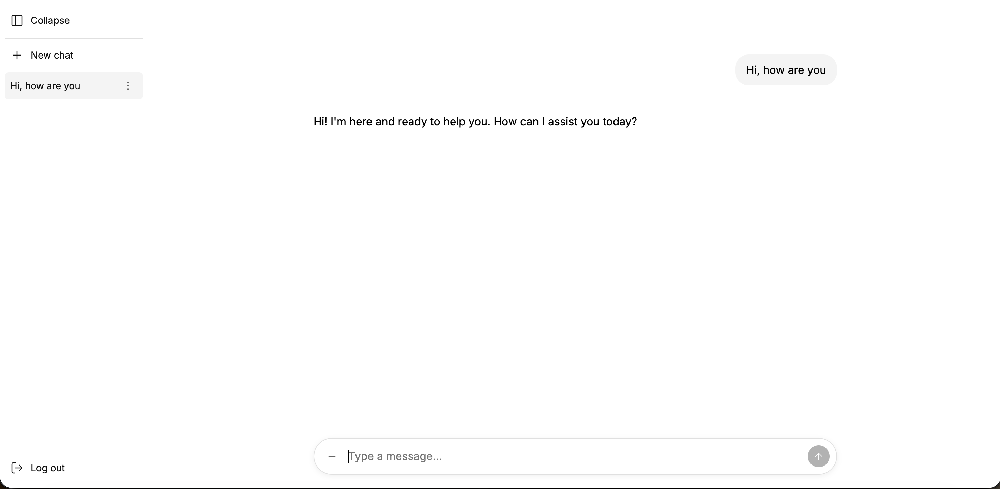
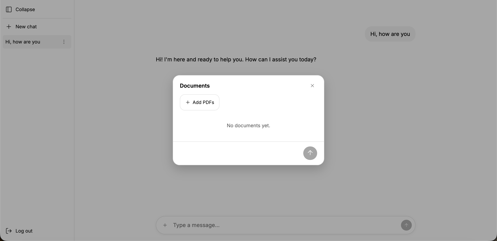
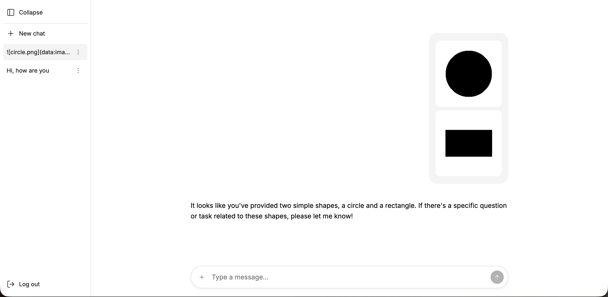
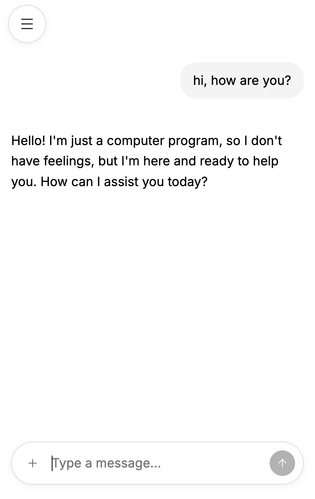

# chatops-frontend-base

A **reusable frontend base for LLM chat products**. Clone it, point it at a backend, and you
have a working chat UI with streaming replies, document uploads, image attachments, chat
history, and edit/retry already solved.

It is deliberately a *base*, not a framework: no design system to learn, no state-management
abstraction to fight. It is plain Next.js App Router, React Query, and a small typed service
layer you can read end to end in an afternoon. The pieces you are expected to replace — how
requests are authenticated and how they reach your API — sit behind two small modules
(`authService`, `backendService`); everything else is components and context.

It is the reference client for
[denisvivdenko/chatops-backend-base](https://github.com/denisvivdenko/chatops-backend-base)
and speaks that API directly: anonymous sessions with silent refresh, the async
`pending → stream → complete/failed` message lifecycle, and `resource://` document links.



**What you get out of the box**

- A **streaming chat UI** — replies render token-by-token over Server-Sent Events, with
  chunks batched to a `requestAnimationFrame` so fast streams stay smooth.
- **Resumable streams** — a stream that drops before a terminal event is reopened and
  rebuilt from the backend's first-token replay, then reconciled against the server's real
  status. No lost or half-finished messages.
- **Full chat management** — create, list, and delete chats, with optimistic updates and
  rollback on failure.
- **Edit, retry, and regenerate** — rewrite an earlier message and regenerate from that
  point, or re-run a failed reply in place.
- **PDF documents** — upload PDFs in a documents modal and reference them in a message as
  `resource://` links; uploads show live `uploading → ready → failed` state with cancel and
  retry.
- **Image attachments** — attach images that are embedded as base64 Markdown and sent to a
  vision-capable model.
- **Anonymous auth, handled for you** — a session is created on first load, the access token
  is refreshed silently on any `401`, and a dead refresh token falls back to a fresh
  anonymous session.
- **Responsive desktop and mobile layouts** — a sidebar layout on wide screens, a mobile
  layout with a slide-in menu, chosen from a single media-query hook.
- A **component test suite** — 32 files of Vitest + Testing Library specs colocated with the
  code they cover.

---

## Contents

- [Quick start](#quick-start)
- [Running locally](#running-locally)
- [How it works](#how-it-works)
  - [The BFF seam: `BACKEND_URL` and the SSE proxy](#the-bff-seam-backend_url-and-the-sse-proxy)
  - [The service layer](#the-service-layer)
  - [Authentication](#authentication)
  - [The context stack](#the-context-stack)
  - [Streaming and reconciliation](#streaming-and-reconciliation)
- [Extending it](#extending-it)
- [Configuration](#configuration)
- [Testing](#testing)
- [CI/CD](#cicd)
- [Next steps](#next-steps)

---

## Quick start

Requires Node 22+ and a running [chatops-backend-base](https://github.com/denisvivdenko/chatops-backend-base)
(or any API that speaks the same contract).

```bash
cp .env.example .env          # sets BACKEND_URL=http://localhost:8000
npm install
npm run dev                   # or: make dev
```

Open [localhost:3000](http://localhost:3000). On first load the app creates an anonymous
session against the backend, so you can start typing immediately — no sign-up, no keys in the
browser.

Then drive it end to end, entirely from the UI:

1. **Type a message and send it.** With no chat open this creates a chat and navigates to
   `/chat/<id>`; the assistant reply streams in token by token.
2. **Open the documents modal** (the `+` in the composer) and **upload a PDF.** It appears with
   an `uploading` spinner, then `ready`.

   
3. **Reference it in a message** by selecting it — the message carries a
   `[report.pdf](resource://<id>)` link and the backend routes it to document ingestion.
4. **Attach an image** from the same `+` menu — it is embedded as a base64 Markdown image and
   sent to a vision-capable model, which can answer questions about it.

   
5. **Edit an earlier message** to regenerate the conversation from that point, or **retry** a
   reply that failed.

Everything the UI does maps onto the backend's HTTP contract — see the backend README for the
authoritative endpoint reference.

On a narrow screen the same app switches to a mobile layout — a full-width conversation and a
slide-in menu behind the hamburger:

| | |
|---|---|
|  |  |

---

## Running locally

### Make targets

| Command | What it does |
|---|---|
| `make dev` | `next dev` on port 3000 with hot reload. The everyday loop. |
| `make build` | Build the production Docker image (`chatops-frontend:latest`) and prune dangling layers. |
| `make run` | Run that image, mapping port 3000 and passing `BACKEND_URL` through. |
| `make prod` | `next build && next start` on the host — the production build without Docker. |
| `make test` | Run the Vitest suite once (`vitest run`). See [Testing](#testing). |

`make` reads `.env` and exports it, so `BACKEND_URL` set there flows into `make run`.

### Host dev loop

The fast path is `npm run dev`. It needs one thing: a reachable backend. Set `BACKEND_URL` in
`.env` to wherever your API lives — `http://localhost:8000` for a locally running
`chatops-backend-base`, or a deployed URL.

```bash
# .env
BACKEND_URL=http://localhost:8000
```

`BACKEND_URL` is a **server-side** variable (no `NEXT_PUBLIC_` prefix), so it never reaches the
browser bundle — see [the BFF seam](#the-bff-seam-backend_url-and-the-sse-proxy) for why that
matters. Changing it requires a dev-server restart.

### Docker

The image is a Next.js **standalone** build (`output: "standalone"` in `next.config.ts`),
which produces a minimal `server.js` and only the node_modules it actually uses:

```bash
make build
make run                              # or: docker run --rm -p 3000:3000 -e BACKEND_URL=... chatops-frontend:latest
```

`BACKEND_URL` is read at runtime, so the same image points at different backends per
environment.

---

## How it works

Three ideas carry most of the app: a thin **backend-for-frontend seam** that keeps the API URL
server-side and proxies the token stream, a **typed service layer** every component talks
through, and a **stack of React contexts** that own state so components stay presentational.
There is no diagram to memorize — the data flow is: component → context → `backendService` →
(browser `fetch` to the API, or the Next SSE proxy route) → backend.

### The BFF seam: `BACKEND_URL` and the SSE proxy

`BACKEND_URL` is injected server-side in `app/layout.tsx`, which passes `${BACKEND_URL}/api`
into the provider tree as `backendUrl`. Because it has no `NEXT_PUBLIC_` prefix it is never
serialized into client JS.

Most calls are still plain browser `fetch`s to that URL (CORS on the backend is wide open for
local dev). The one exception is the **token stream**, proxied through a Next route handler at
`app/api/chats/[chatId]/messages/[messageId]/stream/route.ts`:

```ts
// app/api/chats/[chatId]/messages/[messageId]/stream/route.ts
const upstream = await fetch(
  `${process.env.BACKEND_URL}/chats/${chatId}/messages/${messageId}/stream`,
  { cache: 'no-store', headers: { Accept: 'text/event-stream' } },
);
return new Response(upstream.body, {
  headers: { 'Content-Type': 'text/event-stream', 'Cache-Control': 'no-cache', 'X-Accel-Buffering': 'no' },
});
```

It streams the upstream body straight through — `X-Accel-Buffering: no` keeps proxies from
buffering SSE — so the browser sees a same-origin event stream and the backend URL stays on the
server.

### The service layer

`app/services/backendService.ts` is the single place that knows the backend's wire format. It
exposes one typed method per operation — `fetchChats`, `createChat`, `postMessage`,
`retryMessage`, `modifyMessage`, `deleteChat`, `streamMessage`, `listResources`,
`uploadResource` — and maps the backend's `snake_case` payloads to the camelCase `Chat` and
`Message` types in `app/types/chat.ts`. Components never touch `fetch` or a raw URL.

Errors are normalized in `app/services/errors.ts`: HTTP status codes become typed errors
(`UnauthorizedError`, `AccessDeniedError`, `NotFoundError`, `ServerError`) that callers can
branch on — the active-chat context, for instance, treats a `404`/`403` on a chat as "gone or
not yours" rather than a retryable failure.

### Authentication

`app/services/authService.ts` owns the token. `createAuthApi` returns a `request(path, init)`
function that wraps `fetch` with the bearer token and transparently handles refresh:

```ts
// app/services/authService.ts
const res = await withAuth();
if (res.status !== 401) return res;

try {
  setToken(await refreshAccessToken(baseUrl));   // uses the HttpOnly refresh cookie
} catch (err) {
  if (!(err instanceof UnauthorizedError)) throw err;
  onRefreshTokenError();                          // refresh dead -> start a fresh anonymous session
}
return withAuth();                                // replay the original request with the new token
```

The refresh token lives in an `HttpOnly` cookie the browser sends automatically
(`credentials: 'include'`); the access token is cached in `localStorage` and restored on
reload. `AuthContext` wires this up on mount — creating an anonymous session if there is no
stored token — and exposes the authenticated `request` to the rest of the app via
`useBackendApi()`. `login(username, password)` is a deliberate stub that throws: registered
users are the extension point, not a shipped feature.

### The context stack

State is split across focused providers, composed in `app/providers.tsx` inside a React Query
`QueryClientProvider`:

| Provider | Owns |
|---|---|
| `ErrorProvider` | The single user-facing error banner; auto-clears on route change. |
| `AuthProvider` | The token and the authenticated `request` function. |
| `ChatProvider` | The chat list (a React Query query) plus create/delete mutations with optimistic updates. Derives `activeChatId` from the URL. |
| `ActiveChatProvider` | Messages for the active chat, the send/retry/modify actions, and the streaming lifecycle. |
| `ResourcesProvider` | Uploaded PDFs and their per-item `uploading/ready/failed` state, with cancel and retry. |
| `DocumentsModalProvider` | Whether the documents modal is open. |

Two conventions keep this clean. **State and actions are separate contexts** (e.g.
`useChats()` vs `useChatActions()`), so a component that only dispatches actions doesn't
re-render when data changes. And **the active chat is the URL** — `ChatProvider` reads
`activeChatId` from the pathname, so navigation is the source of truth and deep links just
work.

### Streaming and reconciliation

The streaming logic lives in `ActiveChatProvider` and `readTokenStream` (in `backendService`).
A few properties are worth knowing when you build on it:

- **Attaching is automatic.** Every path that produces a reply — creating a chat, sending,
  retrying, modifying, or just opening a chat whose reply is still generating — ends with a
  `pending` assistant message at the tail of the list. A single effect watches for that and
  opens the stream, so all of those cases are covered in one place.
- **Tokens are batched.** `readTokenStream` accumulates tokens and flushes them on a
  `requestAnimationFrame`, so a burst of chunks becomes one render per frame instead of one
  render per token.
- **The backend is the source of truth on failure.** If a stream throws or reports `failed`,
  the context doesn't trust it blindly — it refetches the message list and reacts to whatever
  status the backend actually holds. Streams replay from the first token, so a reopened stream
  loses nothing (up to `MAX_STREAM_ATTEMPTS` reconnects).
- **Optimistic then reconciled.** A sent user message is added optimistically and rolled back
  if the POST fails; a `modify` truncates the local list to match the backend deleting every
  message after the edited one.

---

## Extending it

The two modules you are meant to replace are the ones that touch the outside world:

| Module | Role |
|---|---|
| `app/services/backendService.ts` | Every backend call and the wire-format mapping. **Point this at your API** — change endpoints and payload shapes here and the components follow. |
| `app/services/authService.ts` | Token acquisition and refresh. **Implement `login()`** (it throws today) to add real accounts, or swap anonymous sessions for your identity provider. |

Because components only ever go through `useBackendApi()` and the contexts, a change to either
module ripples outward without touching UI code. The contexts are the next seam: adding a
feature usually means adding a provider (or a query/mutation to an existing one) rather than
threading state through props.

Styling is plain **CSS Modules** (`*.module.css` next to each component) plus Tailwind v4 and
`app/globals.css` for tokens and resets — restyle by editing those, no theme config to learn.
Layout is chosen by `useMediaQuery('(max-width: 768px)')` in `AppShell`, swapping
`DesktopLayout` for `MobileLayout`; change the breakpoint or the layouts there.

---

## Configuration

| Variable | Default | Purpose |
|---|---|---|
| `BACKEND_URL` | *(none — required)* | Base URL of the backend API. Server-side only; the app appends `/api` and, for the stream route, reads it directly. |

Set it in `.env` (copy `.env.example`). Other knobs live in code rather than env vars:

- `next.config.ts` — `output: "standalone"` for the Docker build, and `allowedDevOrigins`
  (`*.ngrok-free.app`, `*.ngrok.io`) so tunneled dev hosts can load the dev assets.
- `AppShell` — the `(max-width: 768px)` mobile breakpoint.
- `attachments.ts` — `MAX_IMAGE_BYTES` (3 MB) for image attachments.
- `ActiveChatProvider` — `MAX_STREAM_ATTEMPTS` (3) reconnect attempts per message.

---

## Testing

```bash
make test                              # everything, once
npx vitest                             # watch mode
npx vitest run app/context             # one directory
npx vitest run app/context/ChatContext.test.tsx   # one file
```

Vitest runs in a `jsdom` environment (`vitest.config.ts`) with
`@testing-library/jest-dom` matchers loaded from `vitest.setup.ts`, and the `@` path alias
resolves to the project root. The 32 test files are **colocated** with the code they cover —
`ChatContext.test.tsx` next to `ChatContext.tsx`, `MessageInput.test.tsx` next to the
component.

The convention is to **test through what a user does**: component tests render a component (or
a provider tree) and assert on rendered output and interactions via Testing Library and
`user-event`, rather than reaching into internals. Contexts are tested by rendering a probe
component that consumes the hook, so the tests describe the same surface the app uses.

---

## CI/CD

`.github/workflows/ci-cd.yml` runs on every push and PR to `master`:

- **test** — installs with `npm ci` (Node 22, npm cache) and runs `vitest run` against a
  `BACKEND_URL` pointed at the shared backend.
- **build** — needs `test`; builds the Docker image with GitHub Actions layer caching. On a
  push to `master` it also logs in to Docker Hub and pushes the image tagged with the commit
  SHA.

The push step requires the `DOCKERHUB_USERNAME` and `DOCKERHUB_TOKEN` repository secrets.

---

## Next steps

The natural things to add when taking this base toward production:

- **Real user accounts.** Only anonymous sessions exist today; `authService.login()` is a stub
  that throws. Registration, login, and upgrading an anonymous session are the missing pieces —
  the backend already distinguishes anonymous from registered users.
- **A loading and empty-state pass.** `AuthProvider` and the root pages render `null` before
  they're ready; real skeletons and empty states would round off the first-load experience.
- **Richer error surfaces.** Errors funnel into one dismissible banner. Per-action inline
  errors and toasts would communicate more precisely.
- **Streaming polish.** Stop/regenerate controls mid-generation, and a token-latency indicator,
  build naturally on the existing stream lifecycle.
- **Production hardening.** Lock `BACKEND_URL` per environment, and pair with a backend whose
  CORS policy is narrowed from the wide-open local-dev default.
